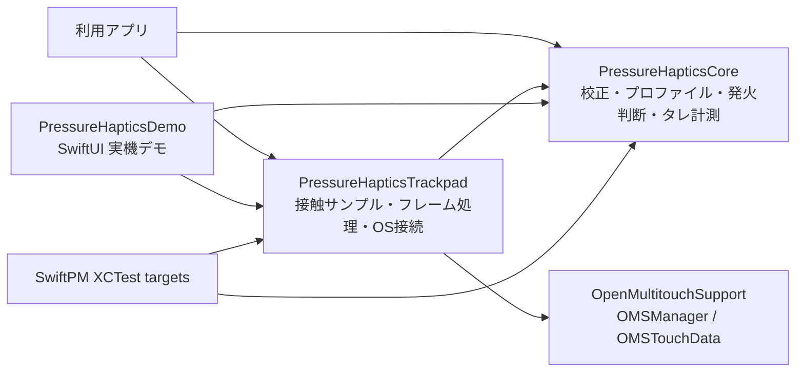
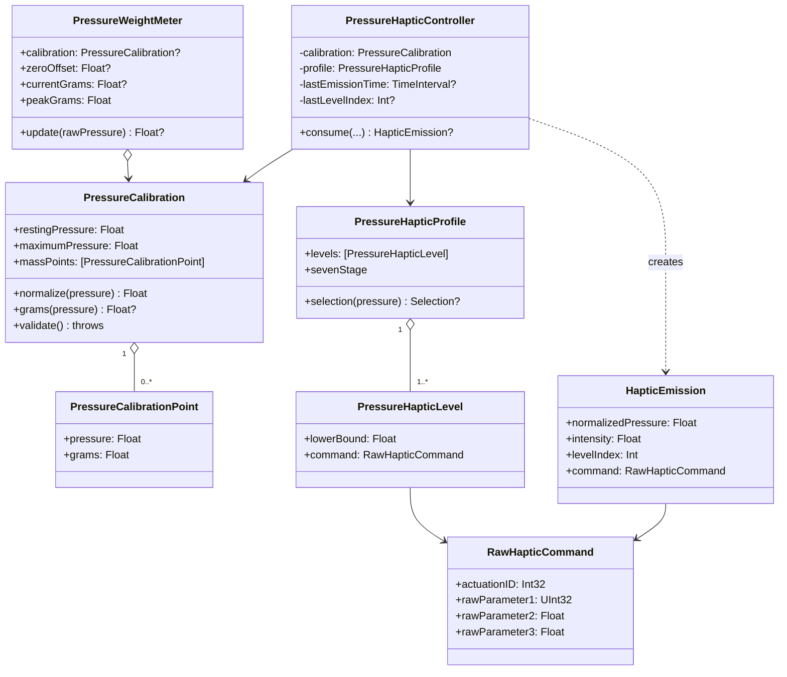
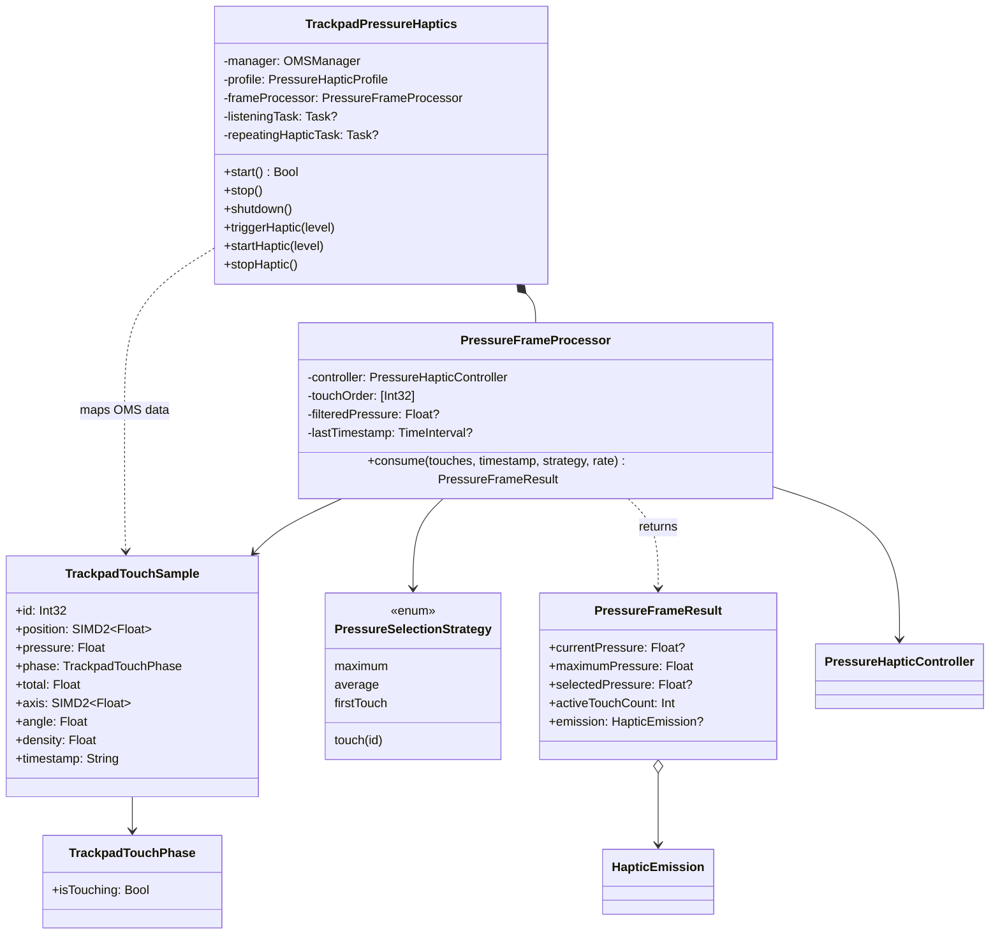
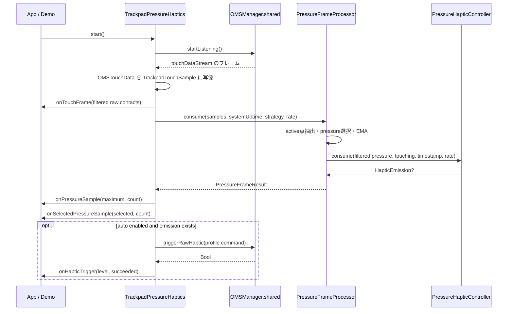

# PressureHapticsKit 構造・実装ガイド

この文書は、この checkout にある Swift Package の構造を、ファイル、Package target、データ経路、型の依存、状態、アルゴリズム、テストの単位まで追えるように記録したものです。公開 API の使い方は [機能ガイド](FEATURES.md) にまとめています。

対象は `Package.swift` が定義する `PressureHapticsKit` です。同じ checkout 内の `gnat/gnat` は別の Python プロジェクトで、Swift Package の target や依存関係には含まれません。確認時点で、README と Swift ファイルには未コミットの作業が存在していたため、この文書は現在のファイル内容を説明し、既存の実装は変更していません。

## 1. 全体像

ライブラリは、入力機器や OS に依存しない圧力処理を `PressureHapticsCore` に置き、Mac のトラックパッドとハプティック出力への接続を `PressureHapticsTrackpad` に置く二層構成です。デモアプリは両方を組み合わせています。



`PressureHapticsCore` に実機 listener はありません。接触フレームを自分で作って処理したり、校正・重量計算だけを使ったりできます。`PressureHapticsTrackpad` が入力 stream とハプティック送信を実機 API に結びます。

### レイヤーごとの責務

| 層 | 所有する責務 | OS / 外部依存 |
| --- | --- | --- |
| Core | 圧力正規化、質量校正の補間、圧力レベル選択、ヒステリシス、出力レート制御、タレ値・ピーク値の保持 | Foundation の型を除き、トラックパッド API に依存しない |
| Trackpad | 接触状態の変換、接触点の選択、平滑化、入力 listener 管理、native haptic command 送信、callback | `OpenMultitouchSupport` と macOS |
| Demo | UI 状態、callback 配線、タレ操作、手動出力、接触消失後の表示リセット | SwiftUI / AppKit |

重量メーターは Core にありますが、Trackpad 層から自動的には呼ばれません。利用側が圧力 callback を受けて、別途 `PressureWeightMeter` に値を渡す構造です。デモがこの使い方をしています。

## 2. Swift Package の build graph

定義元: [Package.swift](../Package.swift)。Swift tools version は 6.0、platform は macOS 13 以降です。

| Product | SwiftPM target | Target type | 直接依存 |
| --- | --- | --- | --- |
| `PressureHapticsCore` | `PressureHapticsCore` | library target | なし |
| `PressureHapticsTrackpad` | `PressureHapticsTrackpad` | library target | Core、`OpenMultitouchSupport` product |
| `pressure-haptics-demo` | `PressureHapticsDemo` | executable target | Core、Trackpad |
| — | `PressureHapticsTrackpadTests` | XCTest test target | Core、Trackpad |
| — | `PressureHapticsKitComprehensiveTests` | XCTest test target (`path: "test"`) | Core、Trackpad |

`OpenMultitouchSupport` は [Package.resolved](../Package.resolved) で version `1.0.12`、revision `1a4aeff416773ae04bfce515f94b872cfa2c47ba` に固定されています。manifest の依存範囲は `from: 1.0.12` です。

`PressureHapticsTrackpad` が外部 product を使うため、実機入力層を import するアプリはその依存も解決します。Core target 自体には OpenMultitouchSupport の依存を足していません。

### manifest に登録されていない Swift ファイル

リポジトリには次の2ファイルがあります。

- [Sources/PressureHapticsCoreTestRunner/main.swift](../Sources/PressureHapticsCoreTestRunner/main.swift)
- [Sources/PressureHapticsTrackpadTestRunner/main.swift](../Sources/PressureHapticsTrackpadTestRunner/main.swift)

どちらも `main.swift` から検証関数を呼び出す実行形式のソースですが、現在の `Package.swift` の `targets` に executable target として登録されていません。一方、[.vscode/launch.json](../.vscode/launch.json) には `pressure-haptics-core-tests`、`pressure-haptics-trackpad-tests`、`PressureHapticsCoreTestRunner`、`PressureHapticsTrackpadTestRunner` の起動設定があります。従って、ファイルが存在することと、manifest 経由でビルド可能な target であることは別です。VS Code の該当設定は、target の登録状況と照合が必要です。

## 3. リポジトリのディレクトリ地図

```text
.
├── Package.swift                         Swift Package の製品・target・依存定義
├── Package.resolved                      外部 Swift Package の解決済みバージョン
├── README.md                             概要、動作条件、最小利用例
├── LICENSE                               MIT License
├── .gitignore                            Swift build 生成物、ローカル作業領域など
├── .vscode/launch.json                   VS Code のビルド／起動構成
├── Sources/
│   ├── PressureHapticsCore/              OS 非依存の圧力／ハプティック計算
│   ├── PressureHapticsTrackpad/          macOS trackpad adapter とフレーム処理
│   ├── PressureHapticsDemo/              SwiftUI executable
│   ├── PressureHapticsCoreTestRunner/    manifest 未登録の検証 runner source
│   └── PressureHapticsTrackpadTestRunner/manifest 未登録の検証 runner source
├── Tests/
│   └── PressureHapticsTrackpadTests/     facade を含む XCTest
├── test/
│   └── PressureHapticsKitComprehensiveTests.swift
│                                         Core と Trackpad の包括 XCTest
├── docs/
│   ├── FEATURES.md                       機能・使い方ガイド
│   └── ARCHITECTURE.md                   この構造ガイド
└── gnat/                                 別プロジェクト。SwiftPM に含まれない
    └── gnat/                             Python package / simulation viewer
```

`test/` は大文字の `Tests/` と別のテスト target path です。両方とも `Package.swift` に登録されていますが、target 名が違います。

### Swift のソースファイル一覧

| ファイル | 担当 |
| --- | --- |
| [PressureCalibration.swift](../Sources/PressureHapticsCore/PressureCalibration.swift) | 圧力校正値、校正エラー、圧力正規化、圧力→グラム補間 |
| [PressureHapticProfile.swift](../Sources/PressureHapticsCore/PressureHapticProfile.swift) | raw native command、閾値レベル、カスタム／標準プロファイル、レベル選択 |
| [PressureHapticController.swift](../Sources/PressureHapticsCore/PressureHapticController.swift) | 選択レベルの時系列状態、rate limit、`HapticEmission` の生成 |
| [PressureWeightMeter.swift](../Sources/PressureHapticsCore/PressureWeightMeter.swift) | タレ、校正質量または生圧力差、現在値、ピーク値 |
| [TrackpadTouchSample.swift](../Sources/PressureHapticsTrackpad/TrackpadTouchSample.swift) | 公開接触サンプル型と OMS の状態／接触データからの内部変換 |
| [PressureSelectionStrategy.swift](../Sources/PressureHapticsTrackpad/PressureSelectionStrategy.swift) | 複数接触点から圧力を選ぶ4方針 |
| [PressureFrameProcessor.swift](../Sources/PressureHapticsTrackpad/PressureFrameProcessor.swift) | 有効接触の抽出、点の選択、EMA、Core controller 呼び出し |
| [TrackpadPressureHaptics.swift](../Sources/PressureHapticsTrackpad/TrackpadPressureHaptics.swift) | OMS listener、lifecycle、callback、native trigger、手動反復 |
| [main.swift](../Sources/PressureHapticsDemo/main.swift) | デモの状態モデル、画面、ウィンドウ設定、App entry point |

## 4. 型の依存とデータ所有

### Core 内の型関係



`PressureHapticController` は校正とプロファイルを initializer で受け取って保持します。フレーム間で変わる `lastEmissionTime` と `lastLevelIndex` は controller が所有します。`PressureFrameProcessor` は controller を内包するため、独自に時刻・EMA・接触順序も所有します。

`PressureWeightMeter` は別系統です。トラックパッド層の frame processor/controller と結線されていません。アプリの callback が raw pressure を meter に渡すことで重さ計測になります。

### Trackpad 層内の型関係



## 5. 実行時の主要データ経路

### 実機から自動ハプティックまで



実装順序は次のとおりです。

1. `start()` が `OMSManager.shared` の listener を開始し、`touchDataStream` を読む task を保持します。
2. 各 `OMSTouchData` を `TrackpadTouchSample` に変換します。入力サンプルの `timestamp` 文字列は保存しますが、圧力処理用の時刻には使わず、`ProcessInfo.processInfo.systemUptime` を別途渡します。
3. `onTouchFrame` を呼びます。callback 用配列では接触中かつ非有限 pressure のサンプルだけを除き、非接触サンプルは残します。
4. `PressureFrameProcessor` を更新し、最大値／選択値／接触数／emission を得ます。
5. `onPressureSample`、`onSelectedPressureSample` の順に callback を呼びます。
6. 自動出力が有効で emission があるときだけ、0始まり `levelIndex` を1始まりに変換して `performHapticTrigger` に渡します。
7. profile の同じ番号の command を native API に渡し、返された Bool を `onHapticTrigger` に通知します。

圧力 callback は接触フレームごとに呼ばれ、空フレームでは最大圧力0、接触数0、選択圧力 `nil` になります。`onTouchFrame` は frame processor より先に呼ばれるため、そこで selection strategy / smoothing / rate を変えるとそのフレーム処理に反映されます。`onPressureSample` と `onSelectedPressureSample` は emission 計算後に呼ばれます。ここで processor 設定を変えた場合は次フレームから反映されますが、`isAutomaticHapticsEnabled` の切替だけは後続の自動出力 gate に影響します。

### Core だけを使う経路

外部入力データをアプリが持つ場合は、`TrackpadTouchSample` の配列を作って `PressureFrameProcessor.consume` に直接渡せます。フレーム結果の `emission` は計算結果であって、native haptic の送信はしません。実際の送信が必要なら Trackpad facade を使うか、Core-only アプリ独自の adapter を実装します。

### 重量計測経路

```text
TrackpadPressureHaptics.onPressureSample
  └─ raw maximum pressure
## 6. Core の内部構造

### 6.1 `PressureCalibration.swift`

#### データ型

- `PressureCalibrationPoint`: 生圧力 `pressure` と質量 `grams` の一点。
- `PressureCalibration`: 安静時圧力、最大圧力、任意の質量対応点配列。
- `PressureCalibrationError`: 検証失敗の種別。

型は `Sendable, Hashable` です。通常 initializer は値をそのまま保存し、検証を呼びません。`init(validatingRestingPressure:maximumPressure:massPoints:)` は構築後に `validate()` を呼ぶ throwing initializer です。

#### `validate()` の順序と条件

1. rest / max が有限で、`maximumPressure > restingPressure` である。
2. mass points が空、または2点以上である。
3. 各 pressure と grams が有限、grams が0以上である。
4. 配列順に pressure が厳密増加し、grams は非減少である。

単調条件違反は pressure 順の問題も質量順の問題も `.massPointsMustBeAscending` にまとめられます。`invalidMassPoint(index:)` の index は元配列内の位置です。

#### 数値計算

- `normalize(p) = clamp((p - resting) / (max - resting), 0, 1)`。
- invalid range または non-finite input は0。
- `grams(for:)` は `massPoints` を pressure でソートし、有限値・非負 grams・厳密 pressure 増加・grams 非減少を再確認します。
- 範囲端の外側は最端の grams を返します。内側は隣接点間を線形補間します。
- mass points が2点未満、不正な圧力、または不正な点群では `nil`。

`validate()` は元配列順を要求しますが、`grams(for:)` はソート後に検証するため、圧力順が入れ替わった配列でも点の対応が妥当なら計算できる違いがあります。単一の不正 mass point は `grams(for:)` では単調性チェック失敗として `nil` になります。

### 6.2 `PressureHapticProfile.swift`

#### 型の役割

- `RawHapticCommand`: `actuationID`, `rawParameter1`, `rawParameter2`, `rawParameter3` を保持する出力レコード。
- `PressureHapticLevel`: そのレベルの下限 `lowerBound` と native command。
- `PressureHapticProfile`: 低い順に並ぶ level 配列を保持し、圧力から `Selection(index, level)` を返す。
- `PressureHapticProfileError`: 空・閾値不正・rawParameter2/3不正・閾値非昇順。

全 value type は `Sendable, Hashable` です。独自 profile initializer は level が空でないこと、各 lowerBound が finite かつ0〜1、rawParameter2/3 が finite、lowerBound が厳密昇順であることを確認します。`actuationID` と `rawParameter1` の値域は追加検証しません。

#### 通常選択

`selection(for:)` は pressure を0〜1に clamp し、`lowerBound <= pressure` を満たす最後の level を返します。最初の lowerBound より低ければ `nil`。NaN / infinity は clamp 前に `nil` です。

#### ヒステリシス付き選択

有効な `previousIndex` がある場合、現在 level を基準に上下へ進めます。

```text
上方向: pressure >= 次 level の lowerBound + hysteresis なら昇格
下方向: pressure < 現 level の lowerBound - hysteresis なら降格
解除:   pressure < 最初 level の lowerBound - hysteresis なら nil
```

境界の上昇判定は `>=`、降下・解除は `<` です。previous index が `nil` または範囲外なら通常選択へ戻るため、初回選択時に既存 level を保持しません。pressure / hysteresis が finite でない、または hysteresis が負なら `nil`。

#### `.sevenStage`

標準プロファイルの値は `PressureHapticProfile.swift` に static data として定義されています。7閾値は 0.15 から約 0.87857 まで等間隔です。actuation IDs は `[3, 3, 4, 4, 4, 6, 6]`、rawParameter2 は `[0.50, 0.75, 1.00, 1.25, 1.50, 1.75, 2.00]`、rawParameter1 は全て0、rawParameter3 は全て2です。内部の unchecked initializer で組み立てるため、一般 initializer の検証はビルド時定数に対して再実行しません。

### 6.3 `PressureHapticController.swift`

#### 保持状態

- 不変: calibration、profile。
- 可変: `lastEmissionTime`、`lastLevelIndex`、公開 `levelHysteresis`。
- すべての内部時系列状態は値型 controller のインスタンスごとに保持。

#### `consume` の状態遷移

1. timestamp が非有限なら、時刻と level の記録をリセットして `nil`。
2. `isTouching == false` なら同じくリセットして `nil`。
3. raw pressure を calibration で正規化し、前回 level と hysteresis を使って profile を選択。
4. level が選べないなら状態をリセットして `nil`。
5. timestamp が前回 emission より前なら既存時系列状態をリセット。
6. level が前回 emission と違えば即時 emission。rate による待ちは level 変更を止めない。
7. level が同じなら、`rate` が finite かつ正で、前回 emission から `1 / rate` 秒以上経ったときに emission。
8. 成功時に時刻と level を保存し、`HapticEmission` を返す。

`rate <= 0` または non-finite は Core controller 内では0 rateとして扱われます。Trackpad facade の `rate` property は負値 / non-finite 値を代入前の値に戻す仕様です。

`HapticEmission.levelIndex` は0始まりです。`intensity` は `0.1 + normalizedPressure * 2.9` で、正規化値0〜1から0.1〜3.0になります。現行 adapter は `intensity` を native API に渡さず、選ばれた profile level の `RawHapticCommand` を使います。振動パラメータを変える箇所は profile の command 定義です。

### 6.4 `PressureWeightMeter.swift`

#### 保持状態

- 不変: optional calibration、`resetThresholdGrams`。
- 外から読めるが直接変更できない状態: `zeroOffset`, `currentGrams`, `peakGrams`。
- `isMassCalibrated`: calibration の mass points が2点以上あるか。

#### 値の計算

- タレが未設定、raw pressure が non-finite、または zeroOffset が不正なら `grams(for:)` は `nil`。
- mass calibrated なら `calibration.grams(rawPressure) - calibration.grams(zeroOffset)` を計算し、負値は0にする。
- mass calibrated でなければ `max(0, rawPressure - zeroOffset)` を返す。この返り値は圧力単位。
- `pressureDelta(for:)` は mass calibration を参照せず、常に圧力単位の差分を返す。
- `tare` は有限値だけを受理し、zeroOffset を置き換えて current / peak を0にする。不正値なら何もしない。
- `update` の計算に失敗すると current を nil にしますが、peak はその時点では消去しません。
- `update` の値が `resetThresholdGrams` 以下なら peak を0に戻し、それより大きければ最大値を保持します。
- `resetTare` は zeroOffset と current を nil、peak を0にします。`resetPeak` は zeroOffset と current を維持します。

名前に `Grams` が付く公開値でも、mass calibration なしの場合は圧力差が入る後方互換動作です。閾値もその圧力単位の数値に対して適用されます。

## 7. Trackpad 層の内部構造

### 7.1 `TrackpadTouchSample.swift`

`TrackpadTouchPhase` は OpenMultitouchSupport の `OMSState` 8種類を同名ケースへ変換します。変換 initializer は internal です。`.notTouching` と `.leaving` だけが `isTouching == false`。他の6状態は true で、starting / hovering / making / breaking / lingering も active として圧力処理されます。

`TrackpadTouchSample` は Sendable / Hashable の独立した値型です。公開 initializer でテスト／合成データを作れます。OMS touch からの initializer は internal で、ID、position x/y、pressure、state、total、axis major/minor、angle、density、timestamp をそのまま写します。元の OMS object を保持しません。

### 7.2 `PressureSelectionStrategy.swift`

enum は Sendable / Hashable で、値は次の4つです。

- `.maximum`: active pressure 最大値。
- `.average`: active pressure の平均。Double で合計・平均してから Float に戻します。
- `.touch(id:)`: 指定 ID の最初の active sample。無ければ `nil`。
- `.firstTouch`: processor が記録した現在セッション最初の active ID の pressure。

戦略 enum 自身に計算処理はなく、実際の分岐は `PressureFrameProcessor.selectedPressure` に置かれています。

### 7.3 `PressureFrameProcessor.swift`

#### 内部状態

| State | 意味 | reset条件 |
| --- | --- | --- |
| `controller` | normalized pressure の level / emission rate state | `reset()`、非接触、選択なし、不正時刻など |
| `touchOrder` | 現在 active な ID の出現順 | contact 消失時に ID を除去、`reset()` で全消去 |
| `filteredPressure` | 選択 raw pressure の直近 EMA 値 | no selection、不正 timestamp、timestamp 逆行、係数変更、`reset()` |
| `lastTimestamp` | 前フレーム timestamp | finite 時刻のみ保存、`reset()` |

#### 1フレームの処理

1. `phase.isTouching && pressure.isFinite` を満たす sample だけを active とする。
2. active 点の最大 pressure を計算。空なら0。
3. `touchOrder` から消えた ID を削除し、現在の配列順で新規 ID を追加。
4. 選択戦略から raw selected pressure を求める。
5. timestamp が前フレームより小さければフィルター値を消す。current timestamp は finite のときだけ保持。
6. pressure と timestamp が両方使えるなら `filtered = sample * alpha + old * (1 - alpha)`。フィルター初回は raw 値がそのまま filtered になる。
7. `PressureHapticController.consume` に filtered pressure を渡す。選択なしは `isTouching == false` として渡し、controller state をリセットする。
8. `PressureFrameResult` を返す。

`selectedPressure` と `currentPressure` は**平滑化前の選択値**です。ハプティックレベル判定には平滑化後の値を使います。このため、同じ結果 object の圧力欄と emission の normalized pressure が一致しない場合があります。

`smoothingFactor` は (0, 1]。initializer に不正値が来た場合は既定値0.35に置き換え、setter に不正値が来た場合は古い値へ戻します。値が変わると filtered pressure だけを消去します。`levelHysteresis` は有限な0〜1で、更新時に controller にも伝播します。不正 setter 値は古い値へ戻ります。

timestamp が non-finite のフレームは selected pressure 自体が返る場合がありますが、controller は invalid timestamp を拒否して emission を返しません。finite timestamp が逆行した場合は smoothing が初期化され、controller も last emission time より前なら emission state を初期化します。

### 7.4 `TrackpadPressureHaptics.swift`

これは Trackpad module の facade / adapter です。`@MainActor final class` として定義され、`OMSManager.shared`、frame processor、callback、listener task、反復タスクをまとめて所有します。

#### 入力 callback と設定

| Member | 役割 |
| --- | --- |
| `onTouchFrame` | frame processor 前の callback 用 sample 配列 |
| `onPressureSample` | active 最大 pressure と count |
| `onSelectedPressureSample` | selectionStrategy で選ばれた raw pressure と count |
| `onHapticTrigger` | 実行した / 拒否した level と成功 Bool |
| `selectionStrategy` | facade → processor に渡す方針。既定 `.maximum` |
| `pressureSmoothingFactor` | facade → processor。既定0.35、(0, 1] |
| `levelHysteresis` | facade → processor / controller。既定0.02、[0, 1] |
| `isAutomaticHapticsEnabled` | 自動出力だけを gate。既定 true。変更時 frame processor 全体を reset |
| `rate` | 自動同一 level 再出力と手動反復周期の入力値。既定0 |
| `lastStartError` | start の最後の失敗理由。success 時 nil |
| `isListening` | 自分が所有し、manager と listening task が共に稼働中か |

#### Listener の排他・所有

- 全インスタンスは `OMSManager.shared` を使う。
- static `activeInstance` は weak 参照で、同クラス内の同時 listener 所有者を記録。
- `ownsListening` はこの instance が `startListening()` 成功を受けて停止責任を持つかを記録。
- `listeningTask` は `touchDataStream` の async sequence を読む task。
- ほかの instance が active、または manager が別経路で既に listening のとき `.alreadyListening`。
- `manager.startListening()` 失敗は `.listenerUnavailable`。
- 自分の `listeningTask` はあるのに manager が停止済みなら、start は既存 task を破棄し `.listenerUnavailable` を返す。
- 成功 start では active owner を登録し、last error と frame processor state を reset して stream を読む。
- 同じ instance がすでに正常 listening 中に `start()` を再度呼ぶと true。

`stop()` は listener task を cancel、手動 repeat を停止し、processor を reset します。manager stop は `ownsListening` が true の場合だけ行い、static owner も自分なら nil に戻します。`shutdown()` は stop の後で4 callback を nil にします。deinit は task を cancel し、listener を所有していれば manager を止めます。

#### Native haptic adapter

公開 initializer は profile と calibration を受けます。内部で closure を作り、`RawHapticCommand` の4値を `OMSManager.triggerRawHaptic(actuationID:unknown1:unknown2:unknown3:)` に対応づけます。`unknown1/2/3` という native API 側の名前は、このライブラリでは `rawParameter1/2/3` として保持します。

`performHapticTrigger(level:)` は1始まり level を検査します。範囲外は native call を行わず `succeeded: false` を通知します。有効 level は `profile.levels[level - 1].command` を送信し、その Bool を result callback に渡します。自動 emission の0始まり `levelIndex` を1始まりに直すのは呼び出し側です。

実装には internal initializer があり、haptic trigger closure を差し替えできます。XCTest はこれを使い、実機 OMSManager に command を送らず、呼び出し command / 成否 / callback を記録します。

#### 手動反復タスク

`triggerHaptic(level:)` は単発です。`startHaptic(level:)` は先に既存 repeat を止めて generation を更新し、同期的に初回 trigger を行います。その時点で level が有効かつ `rate > 0` なら repeating task を作ります。repeat loop は初回 trigger の後に sleep してから次の trigger を行います。

`stopHaptic()` は generation を increment、保持 level を nil にし、task を cancel します。generation token は callback 中の re-entrant start/stop や、cancel 済み task が起床した race で古い task が trigger することを防ぎます。新しい task は wake 後に cancellation と generation 一致を確認します。

`rate` を反復中に変えると古い repeat を止め、新 rate が正なら同じ level で新 task を作ります。0にすると repeat は止まります。負数 / non-finite は以前の値に戻ります。sleep delay は `1_000_000_000 / rate` ns。変換が UInt64 範囲を超えるほど小さな正 rate は `UInt64.max` に飽和し、非常に大きな rate でも最低1nsにします。

### 7.5 `TrackWeightPressureHaptics`

`TrackpadPressureHaptics` への非推奨 typealias です。ソース互換用の名前で、新しい利用側コードは現行名を使います。

## 8. 同期・状態管理モデル

### Actor / Sendable 境界

- `TrackpadPressureHaptics` は `@MainActor` です。listener stream の消費、設定値、callback、trigger result はこの actor 上で扱います。
- Core の値型、サンプル／フレーム型、選択 enum は多くが `Sendable`（比較が要るものは `Hashable`）です。
- `HapticTriggerResult` は public struct ですが、明示的な `Sendable` / `Hashable` conformance は宣言されていません。
- 外部 callback は同期 closure です。async callback queue を作る仕組みはありません。

### 1つの Trackpad instance が所有するもの

```text
TrackpadPressureHaptics
├── OMSManager.shared (共有リソースへの参照)
├── PressureFrameProcessor
│   ├── PressureHapticController
│   ├── contact ID order
│   ├── EMA state
│   └── previous frame timestamp
├── listeningTask (入力 stream reader)
├── repeatingHapticTask (手動出力の反復)
├── repeatingHapticLevel + generation token
└── callbacks + settings
```

自動 pressure haptic の間隔制御は `PressureHapticController` の timestamp 比較です。手動 `startHaptic` の反復は別の `Task.sleep` task です。同じ `rate` property を設定入力として共用しますが、状態・停止操作は分かれています。`stopHaptic()` は手動反復だけを止め、圧力自動発火用 controller は reset しません。`stop()` は両方の活動を停止し、processor も reset します。

## 9. デモの構成

エントリは [Sources/PressureHapticsDemo/main.swift](../Sources/PressureHapticsDemo/main.swift) 1ファイルです。

- `DemoModel` (`@MainActor`, `ObservableObject`): UI 表示値、`TrackpadPressureHaptics`、`PressureCalibration`、`PressureWeightMeter`、接触消失 timer を所有。
- 初期校正は rest=100 / max=600。mass points を指定しないため meter 値は grams ではなく raw pressure delta。
- `onPressureSample` で count を更新。contact count > 0 のとき最大 pressure を保存し、normalized pressure と meter current/peak を更新。
- contact count == 0 になった場合、圧力0をすぐ反映せず2秒待つ。接触が戻れば timer を cancel。2秒後も非接触なら peak を reset し、画面値を0にする。
- tare ボタンは接触中だけ有効で、その時点の保存 pressure を meter の zero とする。
- start/stop、auto haptic toggle、level 1〜7 の直接 trigger を UI から操作。
- `ContentView` は表示とイベント配線、`WindowConfigurator` は AppKit window の最小サイズ・resize 設定、`PressureHapticsDemoApp` が WindowGroup と初期サイズを定義。

## 10. テストと runner の構造

テストファイルは計算型の純粋ロジック、フレーム処理、native 呼び出し境界の3種をカバーする形です。

### SwiftPM XCTest targets

#### `Tests/PressureHapticsTrackpadTests/TrackpadPressureHapticsTests.swift`

Facade を `@testable import` し、internal haptic closure を recorder に置き換えます。MainActor 上で direct trigger、失敗、無効 level、反復 rate、stop/deinit 後の停止、callback 内の同期 stop、nested start、極端 rate、automatic/manual mode、pressure callback と level mapping、OMS touch metadata の保持を検証するテストがあります。時間を待つ async test もあります。

#### `test/PressureHapticsKitComprehensiveTests.swift`

Core と Trackpad の XCTest を同じファイルに置きます。校正 clamp と mass interpolation、タレ・ピーク、profile validation / threshold boundaries、controller の rate / level changes、phase 分類、sample default/equality、4種類の selection strategy、frame result の selected / maximum 圧力を確認します。

### Standalone runner source

#### `Sources/PressureHapticsCoreTestRunner/main.swift`

XCTest ではなく、自前の `expect` を使う executable 形式。校正、7段階 profile、validation、rate limit、rate=0、即時 level change、release reset を関数単位で検証します。

#### `Sources/PressureHapticsTrackpadTestRunner/main.swift`

同じく executable 形式。最大 active pressure、empty frame reset、phase semantics、4選択戦略、firstTouch 順序、empty frame 後の firstTouch 再選択を検証します。

この2 runner の source は `Package.swift` target に現れないため、宣言済み XCTest target と同じ実行経路ではありません。

### テストから分かる境界

- Trackpad haptic command は test closure に差し替えられるため、レベル→コマンド選択や成否 callback を実機なしで検証できます。
- frame processor は手作り `TrackpadTouchSample` を受けられるため、OMS 入力 stream なしで複数接触と phase を検証できます。
- 記載されたテストはロジックや adapter 境界を検証するもので、トラックパッド機種差、実 OS の権限状態、Private Framework の将来互換性を再現しません。

この文書作成ではテストを実行していません。上記はテストファイルと Package manifest の静的な構成記録です。

## 11. ルートファイル・同居プロジェクト

### README、license、IDE 設定

- [README.md](../README.md): package の短い紹介、動作要件、Trackpad facade の最小コード、callback capture と shutdown の注意。
- [LICENSE](../LICENSE): MIT License。
- [.gitignore](../.gitignore): `.build/`、`.worktrees/`、`.DS_Store`、`.omc/`、`.swiftpm/` を除外。
- [.vscode/launch.json](../.vscode/launch.json): Debug / Release の起動定義。存在する Package target と合わない TestRunner 名も含む。

### `gnat/gnat`

`gnat/gnat` は独立した Python package です。`pyproject.toml` / `uv.lock` があり、SwiftPM は参照しません。README が記載する範囲では、FlyGym / MuJoCo の実験、retina/vision、brain backend、motor bridge、実験 runner、ブラウザ viewer を持ちます。依存・起動・テストも Python/uv 系統です。

```text
gnat/gnat/src/gnat/
├── main.py                 CLI entry
├── viewer.py               browser viewer
├── clock.py                simulation timing
├── runner.py               vision→brain step coordinator
├── world/                  MuJoCo / FlyGym world
├── vision/                 FlyGym vision / retina bridge
├── brain/                  brain protocol / backends
├── motor/                  motor bridge
├── experiments/            stimulus protocols / recorder
└── web/                    viewer frontend assets
```

この同居ディレクトリを編集・ビルドしなくても PressureHapticsKit の Swift Package graph には影響しません。

## 12. 読み進める順番

初めて構造を追う場合は、次の順で読むとデータが上から下へつながります。

1. [Package.swift](../Package.swift) — build graph と依存境界。
2. [PressureCalibration.swift](../Sources/PressureHapticsCore/PressureCalibration.swift) — raw pressure が normalized pressure になる計算。
3. [PressureHapticProfile.swift](../Sources/PressureHapticsCore/PressureHapticProfile.swift) — normalized pressure が profile level になる規則。
4. [PressureHapticController.swift](../Sources/PressureHapticsCore/PressureHapticController.swift) — 時刻・level・rate を見て emission を作る規則。
5. [TrackpadTouchSample.swift](../Sources/PressureHapticsTrackpad/TrackpadTouchSample.swift) と [PressureSelectionStrategy.swift](../Sources/PressureHapticsTrackpad/PressureSelectionStrategy.swift) — input model と点の選択方法。
6. [PressureFrameProcessor.swift](../Sources/PressureHapticsTrackpad/PressureFrameProcessor.swift) — frame から Core controller への変換。
7. [TrackpadPressureHaptics.swift](../Sources/PressureHapticsTrackpad/TrackpadPressureHaptics.swift) — listener lifecycle と native output の端。
8. [PressureWeightMeter.swift](../Sources/PressureHapticsCore/PressureWeightMeter.swift) と [Sources/PressureHapticsDemo/main.swift](../Sources/PressureHapticsDemo/main.swift) — Core の重量計算を利用側で結線する例。
9. [包括 XCTest](../test/PressureHapticsKitComprehensiveTests.swift) と [Trackpad facade XCTest](../Tests/PressureHapticsTrackpadTests/TrackpadPressureHapticsTests.swift) — 計算規則と接続境界がどう検証されているか。

## 13. 実装を読むときの要点

1. **pressure 値は文脈ごとに違う。** `TrackpadTouchSample.pressure` と callback pressure は生値、`PressureFrameResult.selectedPressure` は選択済み生値、controller 内部は EMA 後の生圧力を校正して normalized 化した値です。
2. **Core emission は native call ではない。** `HapticEmission` は意図された level/command を表し、Trackpad facade が native API を呼びます。
3. **`intensity` は現在 adapter に接続されていない。** native command の値を変更したい場合は profile の raw parameters を確認します。
4. **automatic と manual repeat は別状態。** 同じ `rate` 設定を使いますが、automatic は frame timestamp、manual は独立 Task と generation token です。
5. **タレ・質量換算はアプリが選択する。** Trackpad facade が `PressureWeightMeter` を自動更新することはありません。
6. **同名でも別の target path がある。** `Tests/` と `test/` はどちらも SwiftPM target ですが、`Sources/*TestRunner` は現在 manifest 登録がありません。
